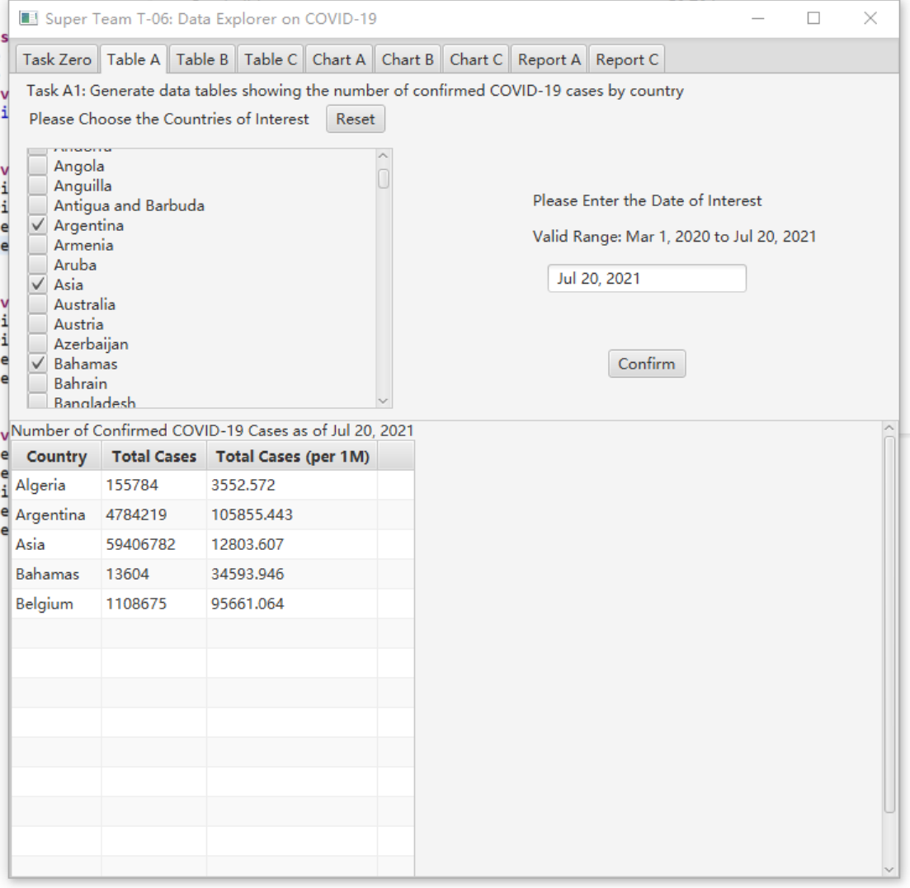

## Super Team T-06

#### Team Repo Link

https://github.com/wlicb/COMP3111-Project.git

#### Team Members

##### 		1. LI Wenbo

email: wlicb | github: wlicb | dev_branch: wlicb_01

Task A1, A2 & A3

##### 		2. ZHANG Yuanhao

email: yzhangiy | github: yzhangiy | dev_branch: yzhangiy_01 and yzhangiy_02

Task C1, C2 & C3		

##### 		3. CHENG Yuhan

email: ychengbj | github: Chelsea-abab | dev_branch: nk_feature1

Task B1, B2

#### Sample Presentation

#### Test Report

[Find Whole Test Report Here](./markdown_src/test_result)

#### Coverage Test Report

[Find Coverage Test Report Here](./markdown_src/jacocoHTML)

#### Javadoc

[Find Javadoc Here](./markdown_src/javadoc)

#### Supplementary Notes

[Supplementart Notes](./markdown_src/sup.pdf)  

[Python Code for Data Normalization: html Version](./markdown_src/Normalization.html)  

[Python Code for Data Normalization: pdf Version](./markdown_src/Normalization.pdf)  

